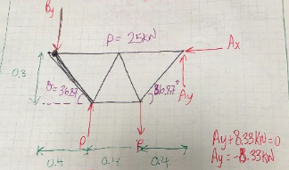
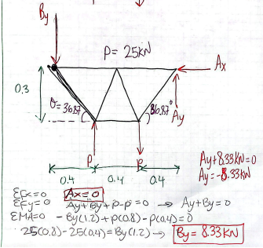
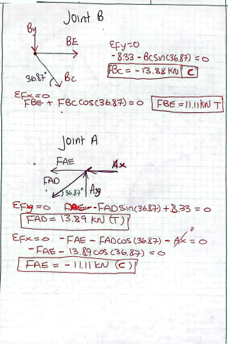
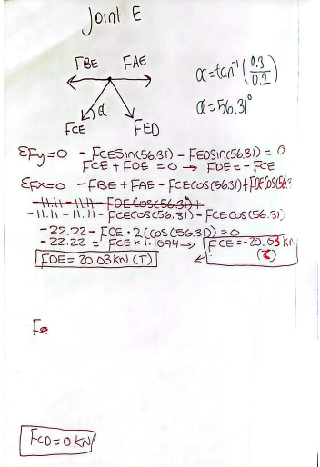
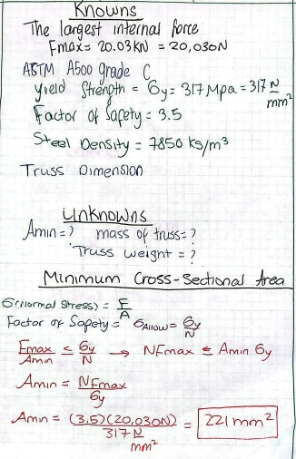
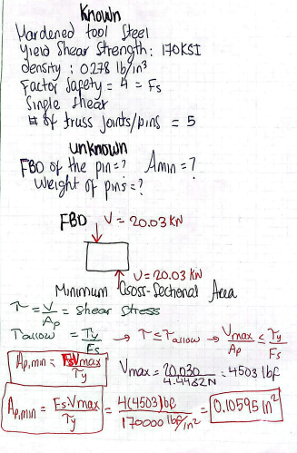

# A2 – Truss Stress Analysis

## Objective
The purpose of this project was to design a lightweight planar truss capable of supporting the loads specified in Figure 1. The truss members were designed using ASTM A500 steel, using hardened tool steel coonection pins. 
The requirements for this assignment was selcting truss geometry, calualtions support reactions and internal force members and creating a fianl CAD model.
## Analyze

- Initial Truss drawing 

-
-  Intial Truss Drawing with Dimensions

The truss has a total horizontal distance of 1.2 m, divided into three 0.4 m sections, with a vertical height of 0.3 m. From this geometry, the outside diagonal members form an angle of approximately \(36.87^\circ\). The applied loads at C and D each have a magnitude of 25 kN but act in opposite vertical directions.

-Support Reactions and INTERNAL FORCE MEMBERS 

IN order for me to find the individual truss memeber i first find Ax and Ay which is the external forces at the support. After finding thr external forces I drew a free-body diagram of the entire truss and used the equilibrium equations and the moments equations and setting them equal to zero to find them. 

From my calculations, I obtained:

$$ A_x=0 $$ $$ B_y=8.33\text{ kN} $$ $$ A_y=-8.33\text{ kN} $$

The negative sign for \(A_y\) means that its actual direction is opposite to the direction I initially assumed on my free-body diagram.

INTERNAL FORCE MEMBERS

After finding the support reactions, I used the method OF JOINTS to find all the others forces in each memeber by using \(\Sigma F_x=0\) and \(\Sigma F_y=0\) to solve the forces directly. I assumed unknown member forces were in tension initially, and a negative result indicated that the member was actually in compression.

At Joint B, I used the \(36.87^\circ\) angle and the previously calculated reaction force to solve for members BC and BE. My calculations gave:

$$ F_{BC}=-13.88\text{ kN} $$

so BC is in compression, and

$$ F_{BE}=11.11\text{ kN} $$

so BE is in tension.
After solving all the internal members, I found out that  $$ 20.03\text{ kN}. $$. This was the largest internal force in my truss, so this will be used  \(20.03\text{ kN}\) as the critical load when sizing the truss members.

Truss Member Cross-Sectional Area

that the 

After determining all of the internal forces, I needed to find a cross-sectional area that would prevent the truss members stress from going to or pass the yield strength. The yield is the point where the materaisl will no longer go back to original shape after it had been stretch or defrom. we Dont want that in ourtruss desgin so I used the largest internal force of \(20.03\text{ kN}\). I sue the largest force member because designing the beam using the largest force member will ensure the otehr smaller forced members will be safe. 

As show the using the factor of safety and the allowable stress the minimum area for the truss is Solving symbolically for minimum area gives 
	​
Single-Shear Pin Design

- 
The next part of my design was determining the required size of the pins connecting the truss members. I chose to analyze the pins as single-shear connections. I used the maximum force of \(20.03\text{ kN}\) as the design shear force so that the selected pin size would be adequate for the most highly loaded connection.

I converted \(20.03\text{ kN}\) to approximately \(4503\text{ lbf}\) and calculated

Approximate Truss Weight

3D CAD Modeling of the Truss
Creating the Truss Geometry

I started my 3D model in Creo by creating a 2D sketch of the truss using the dimensions determined during the truss geometry calculations. I first drew the centerlines of each truss member so that the locations of the members and joints matched my calculated geometry. This provided the basic layout that I could use to create the actual width of each structural member.

After creating the centerline geometry, I used the Offset tool in Creo to create the sides of each truss member. I offset the centerline by approximately 7.5 mm on each side, giving each member a total width of approximately:

$$ w=7.5+7.5=15\text{ mm} $$ $$ \boxed{w=0.015\text{ m}} $$

I then connected and trimmed the offset lines at each joint to create one continuous truss profile. This allowed the entire truss, excluding the pins, to be modeled as one part, as required by the assignment.

Truss Member Cross-Section

From my previous stress calculations, I determined that the truss members required a cross-sectional area of approximately:

$$ \boxed{A=225\text{ mm}^2} $$

Converting this to square meters:

$$ 225\text{ mm}^2 \left(\frac{1\text{ m}}{1000\text{ mm}}\right)^2 = \boxed{0.000225\text{ m}^2} $$

Since the width of each member in the sketch was:

$$ w=0.015\text{ m} $$

I calculated the required extrusion thickness using:

$$ A=wt $$

Solving for thickness:

$$ t=\frac{A}{w} $$ $$ t=\frac{0.000225}{0.015} $$ $$ \boxed{t=0.015\text{ m}} $$

Therefore, I extruded the completed truss profile to a depth of 0.015 m (15 mm). This produces an approximately 15 mm × 15 mm cross section:

$$ A=(15)(15)=\boxed{225\text{ mm}^2} $$

This cross-sectional area was selected to satisfy the required member area while keeping the truss lightweight.

Pin Design

The pins were modeled separately from the truss as cylindrical components. From my previous single-shear stress calculation, the required minimum cross-sectional area of each pin was:

$$ \boxed{A_{p,\min}=0.10595\text{ in}^2} $$

Since the pin has a circular cross section:

$$ A_p=\frac{\pi d^2}{4} $$

Solving for the pin diameter:

$$ d=\sqrt{\frac{4A_p}{\pi}} $$

Substituting the required area:

$$ d=\sqrt{\frac{4(0.10595)}{\pi}} $$ $$ d\approx\boxed{0.367\text{ in}} $$

Because the calculated value represents the minimum allowable diameter, I rounded the pin diameter up to a standard 3/8-inch diameter:

$$ \boxed{d=0.375\text{ in}} $$

I then converted the diameter to meters so that the pin dimensions would be consistent with the units used in my Creo truss model:

$$ 0.375\text{ in} \left(\frac{0.0254\text{ m}}{1\text{ in}}\right) = \boxed{0.009525\text{ m}} $$

Therefore, each pin was modeled with a diameter of:

$$ \boxed{d_{\text{pin}}=0.009525\text{ m}} $$

The pin was extruded to a depth of 0.015 m, which corresponds to the thickness of the truss:

$$ \boxed{L_{\text{pin}}=0.015\text{ m}} $$

This allows the cylindrical pin to extend through the full thickness of the truss at the pin joint.

Material Selection

The assignment specifies A500 structural steel as the material for the truss. However, A500 structural steel was not available in the Creo material library that I used. The assignment states that another type of steel may be used when A500 is unavailable, so I selected HSLA (High-Strength Low-Alloy) steel as the material for the CAD model.

HSLA steel was selected because it is a structural steel with mechanical characteristics appropriate for structural applications and a steel density suitable for predicting the mass and weight of the CAD model. The material was assigned to the Creo model so that the Mass Properties tool could be used to determine the predicted mass and weight of the completed truss.

For the analytical design calculations, the required A500 material properties were retained where specified. The HSLA material selection in Creo serves as the permitted CAD material substitute because A500 was unavailable in the software's material library.
	​

## Decide

## Communicate

