# A3 – [Topic]

## Objective
The purpose for this assignemnt is to design a bar that has a circular cross-section and to determine the minimum geometry while under direct tension load. I chose a value of F=400 lbs that will be applied on the part on creo. The design vvalues are F=400 lbs, E=10000000 psi, max deflection= 0.009in. I chose a diameter of 0.50 in for the bar. 

## Analyze
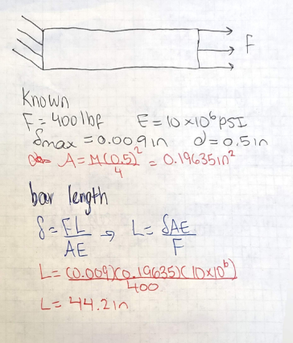 The first thing i did was find the area as 0.19635 in^2.  Then i use the aras along with given values for this assignment to calculated the required bar length using the defromation equation. 
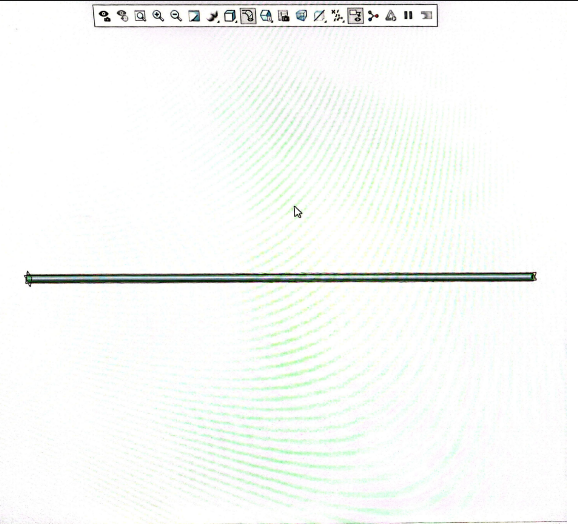 After the calcualtion i created the part on Creo with a 0.5 diamter and a length of 44.18 in.

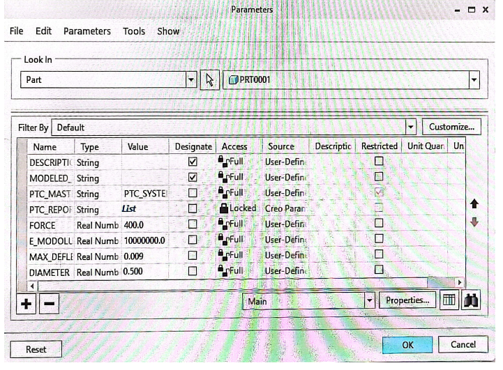
Then i enter my parameter values on Creo, these are the values that was given for the assignemt along with the length calcualtion i got from step 1. 

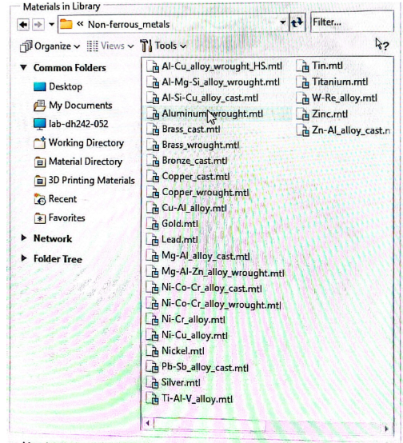

Then i assign the given material from the assigment which is aluminum. I then notice the young's modulus is 70 GPA which i then converted to 10.22*10^6 Psi. Then i compare it with the range that ws given in the assingment 8.5*10^6 < 10.22*10^6 < 11.5*10^6, so it fall in in between it.

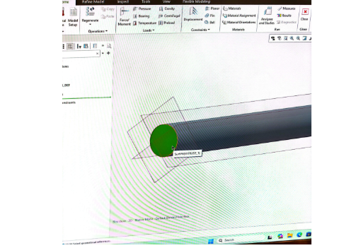

After assignign the material, i click pn stimulate on creo, the nclick on displacement. then i select the left end of the bar, that will be the location where the bar is fixed. 

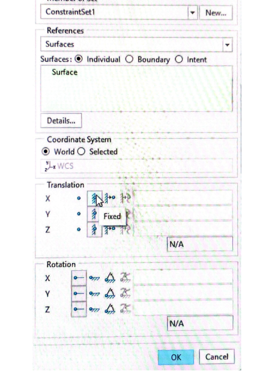
Then  i constraint all 3 translation because i dont want any movement in the x.y. and Z direction; the bar is suppose to be firmly attached to the wall support while the other end is where to force is applied. 

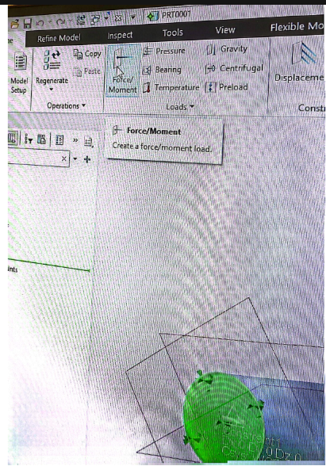

Next i click FORCE/MOMENT under loads the ni click the opposite end othe bar. This the end where the 400 lbs force will be applied. I then type 400 under force component in the x diection becaue the forcd is only applied in the x direction so i left the y and z blank. the n i change the units to lbf, then i click run so Creo can run it. 

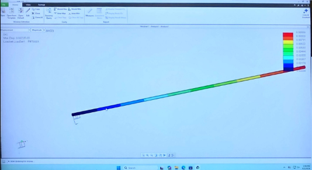
I run the analysis to generate the deflection map shown above. 

### Deflection Map

according to the deflection map show above the maximum deflection is 0.00889 in which is the close to the value of .009 in that was given for th assignment. 
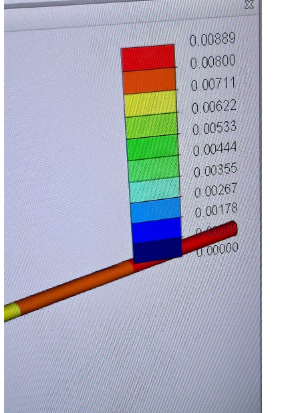

### Von Mises Stress Map

Then i generate the VOn Mises stress map using the same step. The von Mises result is 2299.26
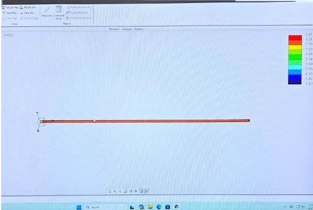
 
### Safety-Factor Calculation

## Step 3 – Design Reflection
### Hand Calculation Compared With FEA
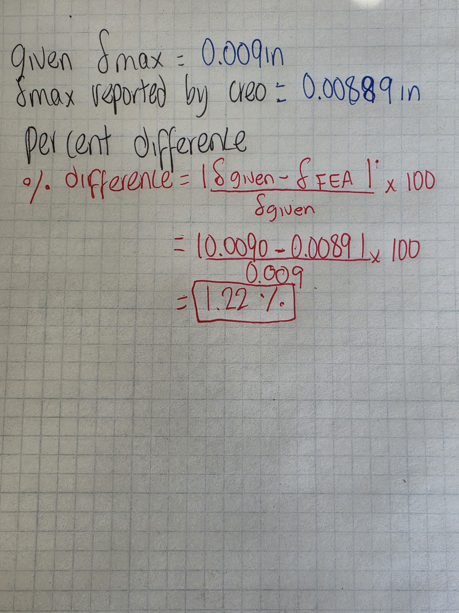

The 1.22% difference is small, so the two methods essentially agree. one reason for this diffefence is that Creo’s wrought-aluminum material used a slightly higher Young’s modulus of approximately 70–70.5 GPa. Other minor differences could have resulted from rounding the calculated length to 44.18 inches. I would place slightly more confidence in the FEA displacement because it used the actual material properties assigned inside Creo and the exact model geometry but that the given displacement is verifaction that what i did was good. 

### Pin-Hole Stress Concentration

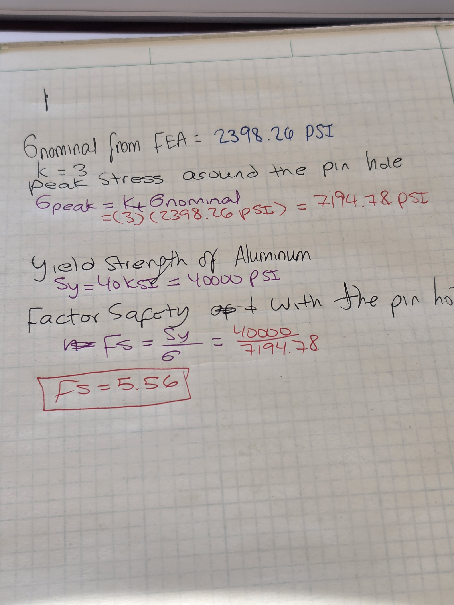
according to the calculations shown above the design passes with a factor of safety of 5.56

## Step 4 – Lessons Learned
### Mistakes and Corrections

ONe mistake that i almost made was not matching the units displayed on creo wwith the units from the assignment. Another mistake is the disrection of forces, because i did not know whether to force was point inward or ways from the bar. I lean that the force had to be away to accurately represent tension. I learned that I  had to place the constraints on the x, y , and Z directions for the left side of the bar which represented a rigid connection to a wall. Finally, I learned that the maximum value on a stress map is not always identical to the simple nominal stress. 

## CAD File Download

## Decide

## Communicate

