# A4 – [Topic]

## Objective

## FEATURE 1 

This is the calculation of the maximum stress equation for this assignment. I used the beam bending stress equation and the moment of inertia for a rectangular corss-section to caluclate the maximum stress equation. 

FOr the design to be safe, the actual stress must be greater or equal to the allowable stress. Using the allowed stress and actual stress i then solve solve for the hyield. The hyield is the minimum thickness that the beam must be so that it does not exceed the allowable bending stress. 
The i solve for hd. The hd is the minimum thickness that the beam can be so that it don't pass the maximum allowed deflection of 0.3mm. I used the maximum delfection for a cantilever beam with a concentrated point load equation, then i substitute the moment of inertia equation to solve for the hdeflection. 
The Sy is the tensile strength of ABS material which is 29.6 MPA.

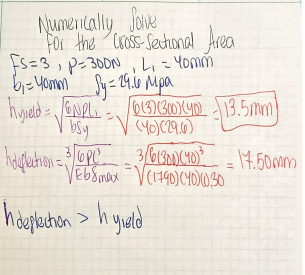
FOr this i chose a L1 and L2 of 40 mm. The yield required a minimum thickness of 13.51 mm, while the deflection required 17.50 mm. I chose the biggest h value of 18.5 to be the h value for the CAD design because 18 it meets the deflection requirement and it won't add to much thickness to the material to make a more efficient design. 

## FEATURE 2

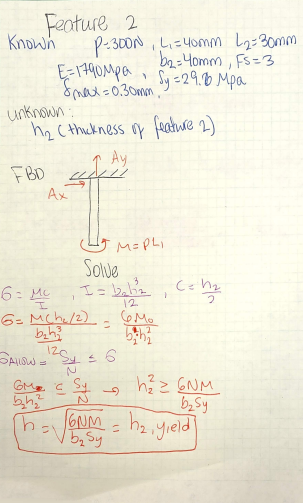

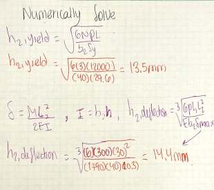
Feature 2 was modeled as a cantilever beam fixed to rigid wall A and subjected to the moment transferred from Feature 1. The yield calcualtion was a minimum required thickness of 13.5 mm, while the deflection calculation had a minimum thickness of approximately 14.45 mm. Since the deflection requirement controlled the design, so i can only choose a h value that is highher than both of them.  I selected a 15 mm thickness for Feature 2 so that both the yield and 0.30 mm deflection requirements were satisfied.

## ISOMETRIC VIEW 
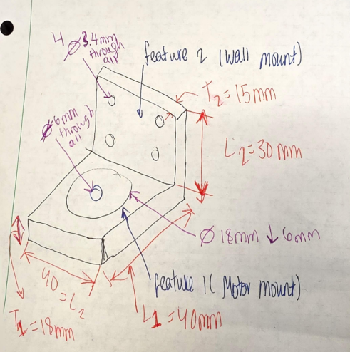
I started out by drawing an isometric sketch of the motor mount before I even touched the CAD software. This really helped me figure out the connection between Feature 1 and Feature 2, not to mention finding the right spots for the motor and wall mounting holes. I made sure to pull in the dimensions from MY calculations, so the sketch worked as a solid roadmap once I got into the solid works model.

For the main specs, Feature 1 ended up at 40 mm long and 18.5 mm thick. Feature 2 had a height of 30 mm and a thickness of 15 mm, with the whole thing coming in at a width of 40 mm.

## CAD DRAWING

### Step 1 – Creating Parametric Dimensions

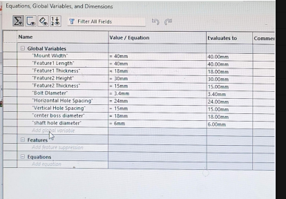. 
When I started the solidworks model, I decided to set up parameters for all the main dimensions rather than just typing them in one by one. I set these up for things like the total width, the lengths and thicknesses for both Feature 1 and Feature 2, plus the shaft clearance and bolt-hole diameters. 

Going this route makes the whole model a lot more flexible. If I need to change something, I just update the parameter and the geometry follows suit. Plus, the assignment actually called for parametric modeling wherever it made sense, so this kept me on track with those requirements.

### Step 2 – Creating Feature 1

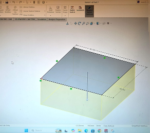
I first created the horizontal motor-support section. I sketched the rectangular profile for Feature 1 and used the Extrude command to create the solid geometry.

The calculated minimum thickness based on deflection was 17.50 mm, but I used 18.5 mm

for the extrusion thickness. This ensured that my CAD geometry remained above the analytical minimum.

### Step 2 – Creating Feature 2
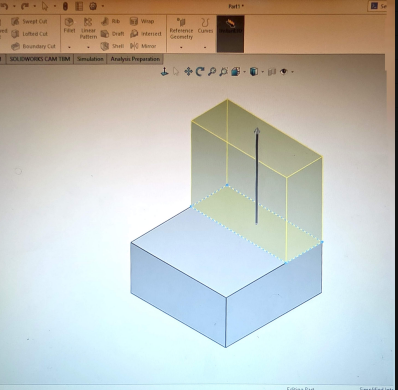

After that, I moved on to the vertical wall-mounting section. I drew the sketch for Feature 2 so it was perpendicular to Feature 1, then extruded it out to match the full width of the mount.

The math for the deflection suggested I needed about 14.45 mm, so I ended up going with a final thickness of 15 mm. I also stuck with the 30 mm height I had picked out earlier. In the end, it turned into one solid L-shaped part instead of a bunch of separate pieces.

### Step 3 – Creating the Motor Clearance

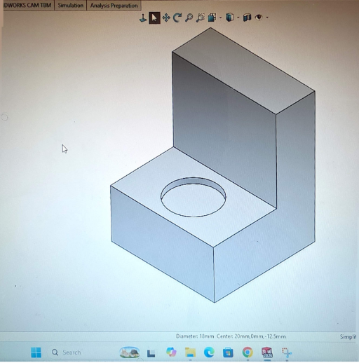

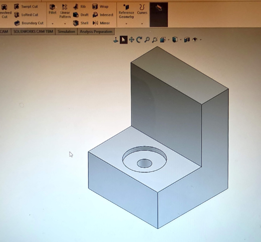

Once Feature 1 was done, I pulled the motor specs from Appendix A to figure out exactly where the shaft and mounting holes needed to go. The motor has this 22 mm locating feature on the front, so I worked right off the drawing instead of just guessing the size or placement of the opening.

I drew the circles on the top face of Feature 1 and then used an extruded cut to clear out the material. This gave me the room I needed for the motor and shaft while making sure everything stayed perfectly centered on the mounting surface.

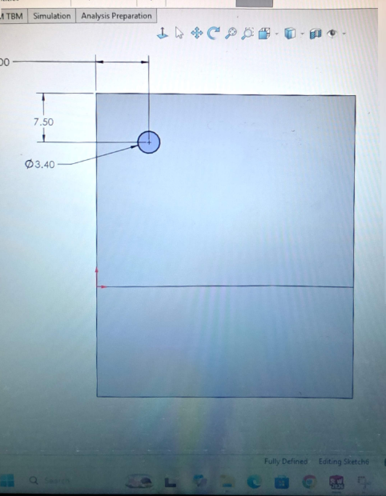

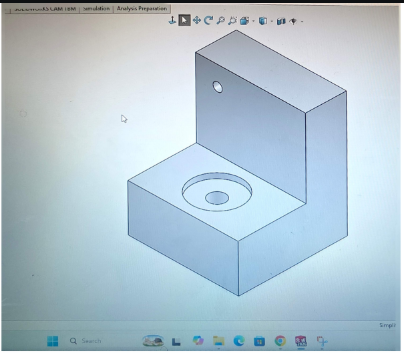

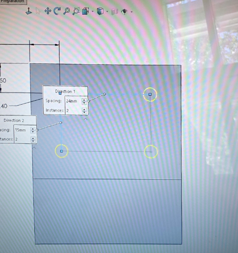

### Design features on the motor mount to minimize deflection.

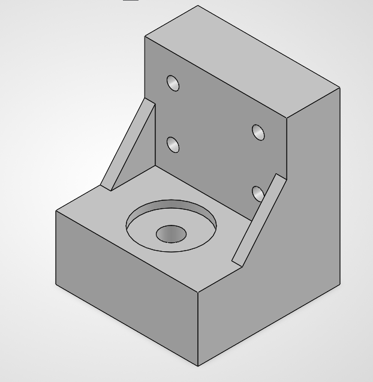

To keep the mount stable without making the whole thing bulky, I decided to add triangular gussets between the motor-support and wall-support plates. By reinforcing the fixed corner where the bending moment is strongest, these gussets really stiffen up the assembly. It’s a great way to cut down on the deflection for Feature 1 without needing to increase the thickness of the entire mount.
## Communicate

