# A5 – [Topic]

# Objective

# Analyze
##  Stress Analysis

### Feature A

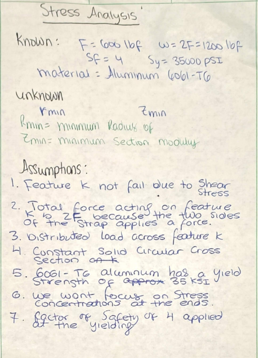

Feature K is to support the polyester strap that applies the horizontal load to the rigid T-beam. For this design I selected an applied force of 600 lbf, which meets the problem requirement of 500<F≤800 lbf. The strap is pulling on both sides of Feature K, so the total load on the feature is twice the force applied. The total load used in the analysis is thus W=2F=2(600)=1200 lbf

The bracket was made of Aluminum 6061-T6 material. The analysis was performed with the yield strength of approximately 35,000 psi. The safety factor for the assignment is 4.
The material selected is Aluminum 6061-T6.

The biggest unknown is the smallest radius for Feature K. The first step in determining the radius is to find out the minimum required section modulus. Once the minimum radius is identified, the minimum diameter of the cylindrical feature can be determined using D=2R
for the assumption It is assumed that feature K is not failing in direct shear as specified in the assignment for this analysis. The polyester strap is assumed to exert two equal forces on the feature, resulting in a total force of 2F. The strap load is modeled as a distributed load along Feature K.

Feature K is modeled as a beam of constant solid circular cross section. The material is taken to be linearly elastic up to the yield point. The first sizing calculation ignores stress concentrations around the ends of the feature.

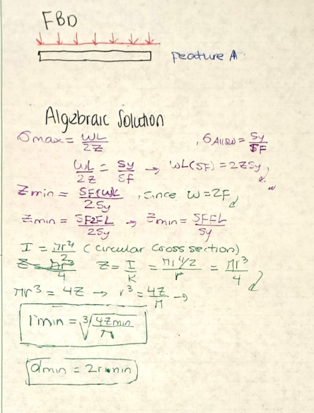
The free-body diagram for Feature K shows the cylindrical member supporting the load from the polyester strap. 
The maximum bending stress equation provided in the assignment is σmax​=2ZWL​ and The allowable stress is determined by dividing the yield strength by the safety factor is σallow​=SFSy​. For the design to satisfy the required safety factor, the maximum bending stress must not exceed the allowable stress so WL/2Z=Sy/Sf and Z. 
Feature K is designed with a solid circular cross section. The moment of inertia for a solid circular member is I=πr4​/4. The section modulus is defined as Z=I/r, then I Substitute the moment of inertia equation to get r. 
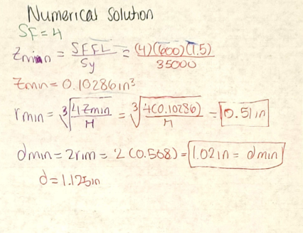

​
### Feature B

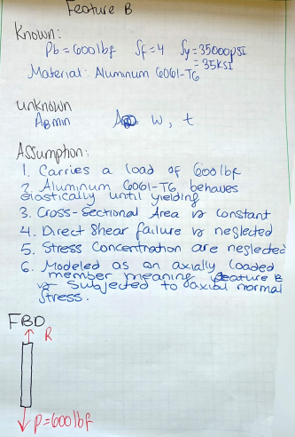
For Feature B, I used the reaction force calculated from Feature A as the applied load. Since Feature A is supported symmetrically, the total 1200 lbf strap load is divided equally between the two supports. This gives an applied load of 600 lbf on each Feature B.

So here's what went down with Feature B—we treated it like an axially loaded member. The force coming from Feature A pushes down on Feature B, and the bracket's other parts push back up with equal force. We neglect direct shear failure (like the assignment said) and didn't worry about stress concentrations at the joints for the initial sizing. Pretty straightforward.

We went with a safety factor of 4 to keep things nice and safe, making sure Feature B stays below the yield strength of Aluminum 6061-T6.

I pulled Feature B out from the rest of the bracket setup to draw up the free-body diagram. So here's what's going on: Feature A is pushing down on Feature B with a force of 600 lbf at its bottom end. Meanwhile, the upper part of the bracket is pushing back up with a reaction force to balance things out.

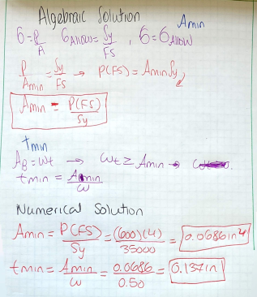
Since Feature B acts like an axially loaded member, I went with the standard normal stress formula: σ=P/A. 
To find the allowable stress, you take the material's yield strength and divide it by your safety factor:
σallow​=Sy/FS
When you're looking for the smallest cross-sectional area that'll work, I set the normal stress equal to the allowable stress and solve for the minimum area​. which comes out to be 0.0686 in^2​. 
Since Feature B has a rectangular cross section: A=wt, the selected width and thickness must satisfy 0.0686 in^2. Using that logic i found out that the min thickness is 0.137 in

### Feature c

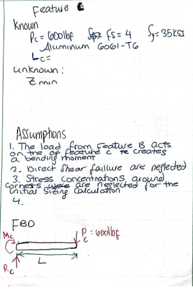
For Feature C the load came from the previous part so the lower section could handle the bending. It needed to keep the safety factor at 4 under that 600 lbf. The numbers used were the load itself, the factor of safety, and the yield strength at 35000 psi. The bracket material was Aluminum 6061 T6. For the analysis, I used: P_C=600 lbf, FS=4, S_y=35,000psi. The material selected for the bracket was Aluminum 6061-T6. The length of Feature C was determined from the dimensions of the rigid T-beam. The main values I needed to determine were the minimum section modulus and the minimum height of Feature C. 

For the assumption of this analysis, it is assumed that the load from Feature B is transferred to the right of Feature C and forms a moment due to the transfer of load. It is also assumed that the left end of Feature C is the resisting connection that offers both vertical reaction and moment reaction.
Another assumption made for this analysis is that direct shear failure can be ignored, as per the assignment. Stress concentration due to corners and connections is ignored initially for the calculation of strength, and the cross-sectional shape of Feature C is considered rectangular.

For the FBD Feature C was separated from the remaining bracket structure. There is a load of 600 lbf applied vertically to the right of the feature. To the left of the feature, there is a reaction force R_c and a moment M_C.

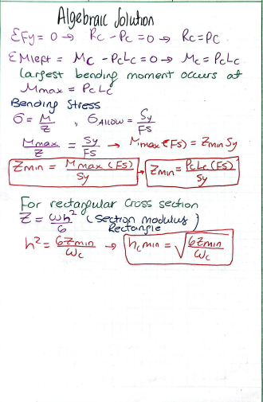
FOr the algebraic solution, I used moment equilibrium about the left side of Feature C: ∑Mleft​=0, to get the largest bending moment occurs at the resisting end as MC​=PC​LC. To determine the required section size, I used the bending stress equation σ=M/Z, the allowable stress σallow​=Sy/FS and setting them equal to solve for Zmin. For the rectangular cross section, I used: Z=(Wc*h^2)/6 as the section modulus to solve for the hmin​. ​​​​​

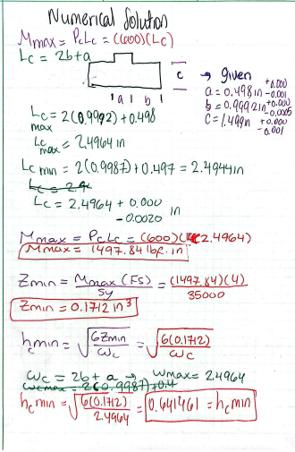

FOr the Numerical Bending Moment i use PC​=600 lbf, LC​=2.4964 in, to solve for the Mmax the maximum bendding moment. Next, I calculated the minimum required section modulus as 0.1712 in , this means Feature C needs a section modulus of at least: 0.1712 in. 
Then for the Minimum Height of Feature C Using the rectangular section modulus equation Z=Wh^2/6, and Using the width adopted in my calculation  I solved for the minimum height of 0.6415in. 

### FEATURE D
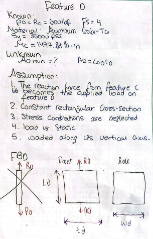

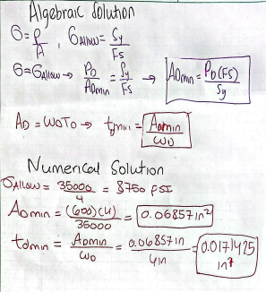

### FEATURE E 
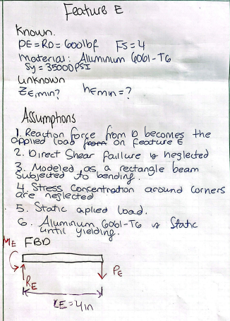

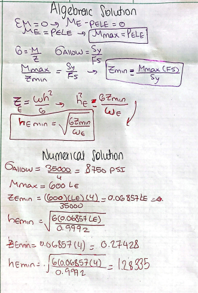

##  Stifness Analysis

### FEATURE A
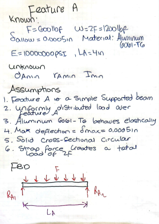
Regarding Feature A, I calculated the rigidity of the cylindrical support structure of the strap to ensure that it would not deflect by more than the maximum allowable deflection which is equal to \(0.005\) in. There is loading due to the polyester strap on either side of Feature A. 
The force applied by each side of the strap is: F=600 lbf. Since the strap acts on both sides W=2(600). The material used is Aluminum 6061-T6, with an elastic modulus of approximately: E=10,000,000 psi.

Modeling Feature A, I have taken it to be a simply supported cylindrical beam. The load by the polyester strap is taken as uniformly distributed load along the beam. Since the loading and geometry of the structure are symmetrical about its axis, it is assumed that the two supports will have the same reaction force.

Other assumptions include linear elastic behavior of the material, constant cross-section, applicability of small deflection beam theory, and neglecting shear deflection effect.

	
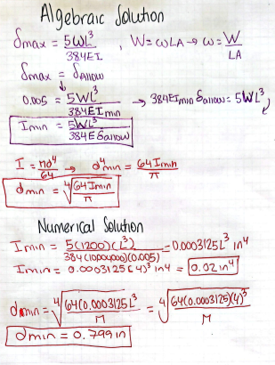

For the deflection analysis of Feature A, I modeled the cylindrical member as a simply supported beam with a uniformly distributed load from the polyester strap. Since the maximum allowable deflection is 0.005 in, I used the simply supported beam deflection equation and and rearranged it to solve for the minimum required moment of inertia. To solve numeric02lly, the values for the load W=1200 lbf, length LA=4.00 in, modulus of elasticity E=10,000,000 psi, and deflection of 0.005 in were used in the equation, which resulted in a minimum required moment of inertia of 0.2in^4. After finding the required moment of inertia, I used the moment-of-inertia equation for a solid circular cross section, and rearranged it to solve for the minimum diamete  and Substituting I=.2 gave dmin as 0.799

### FEATURE B
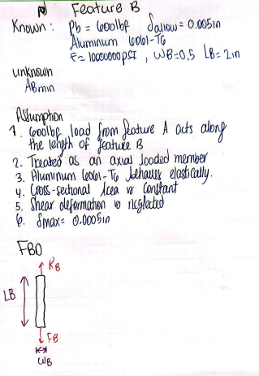

Since the force transferred from Feature A acts mostly along the feature's length, I treated Feature B as an axially loaded member for this analysis. I made the assumption that the cross-sectional area stays constant along the length and that the load operates through the cross section's center.

Additionally, I assumed that shear deformation could be disregarded, the force was static, and Aluminum 6061-T6 behaved linearly elastically. A maximum of 0.005 inches of axial distortion was permitted.
When Feature B is isolated from the rest of the bracket, Feature A applies a downward load of 600 lbf at the lower end. The upper portion of the bracket provides an equal reaction force in the opposite direction.

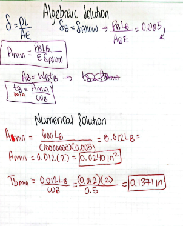
For an axially loaded member, I used the axial deformation equation δ=PL/AE, Since the maximum allowable deformation is \(0.005\) in, I set δB=δallow, and rearranged the equation to solve for the minimum required cross-sectional area. For the numerical solution, I substituted the applied load (P_B=600 lbf, selected length L_B=2.00 in, elastic modulus E=10,000,000 psi, and allowable deformation5in δallow of 0.00  in. 

After finding the required cross-sectional area, I used the rectangular area equation A=wt

I selected the width of Feature B as w=0.50 in and solve for tmin, resulting in tmin=0.0048 in
	​

### FEATURE C
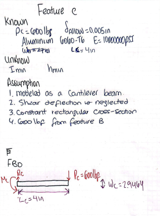
Feature C's stiffness is crucial. I ran an analysis to ensure the lower member doesn't deflect over 0.005 in. The 600 lbf force from Feature B is the load on Feature C. It acts perpendicular, so I treated Feature C as a cantilever beam with bending

I treated Feature C as a cantilever beam. The left side of Feature C was treated as the resisting connection, and the 600 lbf load acts downward on the right side. I assumed the load is static, the cross section stays constant, and Aluminum 6061-T6 behaves elastically. I also neglected shear deformation; I used small-deflection beam theory.

The load transferred from Feature B acts downward on the right side of Feature C. The left side provides an upward force and a moment.

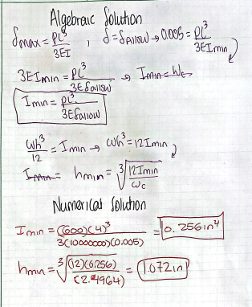

For a cantilever beam with a point load at the free end, I used the δmax​ equation. 
Since the maximum allowable deflection is 0.005 in, then  I set:  δC=δallow and rearranged the equation to solve for the minimum required moment of inertia. Then i subtituted in the known values and get Imin= 0.06223 in^4. To Find the Minimum Height since Feature C has a rectangular cross section, so I use momnet of inertia and then I rearranged the equation to solve for the minimum height of 0.572 in

### FEATURE D
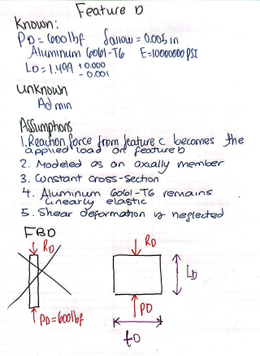
For Feature D, a stiffness analysis was performed to ensure the vertical member's deformation didn't exceed \(0.005\) in. The reaction force from Feature C is the applied load on Feature D. It mainly acts along Feature D's length; thus, I modeled it as an axially loaded rectangular member.

For this analysis, I treated Feature D as an axially loaded member, and the reaction from Feature C becomes the applied load on it. Feature D's opposite end provides an equal reaction force, essentially balancing the load from Feature C.

I made a few assumptions about the load. It acts through the center of the cross section. That member has a constant rectangular cross section. Also, Aluminum 6061-T6 behaves linearly elastically. The loading is static, and there's a limit on the maximum allowable axial deformation, it's 0.005 in.

For the FBD, the two forces act in opposite directions along the length of Feature D when it's isolated.

 
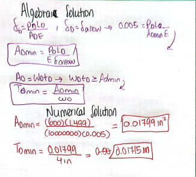
Since Feature D is axially loaded, I used the axial deformation equation, and set  δC=δallow. I then rearranged the equation to solve for the minimum required cross-sectional area. then i Substitute the known values to get Amin=0.01799 in^2. 

Since Feature D has a rectangular cross section A=wt. I rearranged the equation to solve for the minimum thickness and i subtitute in the value and got a tmin of 0.0045

### FEATURE E
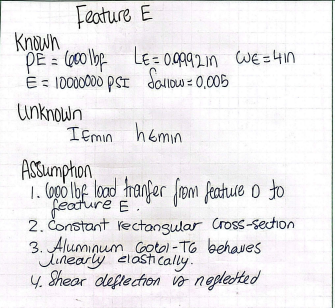

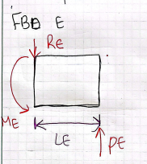

I performed a stiffness analysis for Feature E to make sure the upper horizontal member would not deflect more than the maximum allowable value of 0.005 in. The reaction from Feature D becomes the applied load on Feature E. Based on the load direction established from Feature D, the applied force \(P_E\) acts upward on Feature E. Feature E was modeled as a cantilever beam under bending.

In this analysis, Feature E was treated as a cantilever beam with a rectangular cross section. At one end, the 600 lbf force from Feature D was applied, and the opposite end provided the reaction force and moment.

It was assumed that the loading was static, the cross section was constant, Aluminum 6061-T6 behaved linearly elastically, and small-deflection beam theory applied. As required, shear deflection was neglected.

For the FBD, since Feature D applies an upward force to Feature E, the applied load is P_E = 600 lbf.
	​
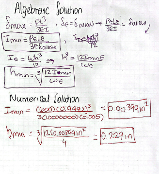

# Multiview Sketches
### STRESS
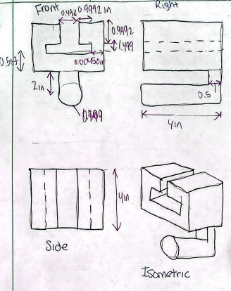

I created two separate multiview sketches for Features A through E after completing the strength and stiffness calculations to show how the calculated dimensions affect the final bracket geometry. One sketch pretty shows the stress analysis dimensions, and the other shows the stiffness analysis dimensions.

Each sketch includes a front view, right-side view, top/side view, and an isometric view. Orthographic views show important feature dimensions more clearly than isometric views alone. I also used the T-beam dimensions provided in the assignment to make sure the bracket geometry would fit around the rigid T-beam.

The stress-analysis sketch uses the minimum dimensions from the strength calculations. These dimensions prevent yielding and maintain a safety factor of 4. The stress-based dimensions included the required diameter of Feature A and the minimum thicknesses or heights of Features B through E.

### STIFFNESS
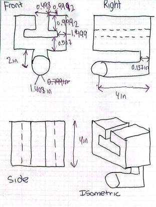

Based on stiffness calculations, the second multiview sketch was created. I used dimensions that kept each feature's deflection below the maximum allowable value of 0.005 in. Since stiffness and stress calculations check different requirements, the two sketches have some different dimensions.

The sketches helped me see how the five features connect and how the load moves from Feature A to the rigid T-beam. It was easier to identify which dimensions are strength-controlled and which are stiffness-controlled.

# Lessons Learned
### Governing Failure Mode
For Feature C, stiffness governed the final required dimension. From the stress analysis, the minimum required height was hC,stress​=0.64146 in, while the stiffness analysis required was hC,stiffness​=1.0721 in. The stiffness requirement was larger by 1.0721−0.64146=0.43064. Since Feature C needed a larger dimension to satisfy the deflection requirement, stiffness controlled the final design. 

### Error propagation

Error propagation was a concern in my design, particularly with the load transferred between features. The reaction force from Feature A was used as the applied load on Feature B, and this load was then carried through to Features C, D, and E. Because of this, if I had calculated the reaction from Feature A incorrectly, every feature after it would also have been sized using the wrong load.

At each step, I used equilibrium to check the force transfer before moving on to the next feature. For example, I verified that the 1200 lbf total strap load on Feature A was split into two 600 lbf reactions. This helped prevent incorrect reaction forces from affecting the rest of the calculations.

### Assumption sensitivity

One important assumption I made was that the polyester strap load is distributed evenly across Feature A, so the 1200 lbf load is split into two 600 lbf reactions. I used those 600 lbf reactions as the loads for the later features.

If the load isn't distributed evenly, one side of the bracket could carry over 600 lbf. That would increase the stress and deflection in Features B, C, D, and E. So, the minimum required thicknesses and heights calculated for those features would increase.

The final dimensions of the bracket depend strongly on the assumed load distribution. If the real loading is more uneven than assumed, the bracket would need to be made larger or reinforced to maintain the required safety factor and deflection limit.
