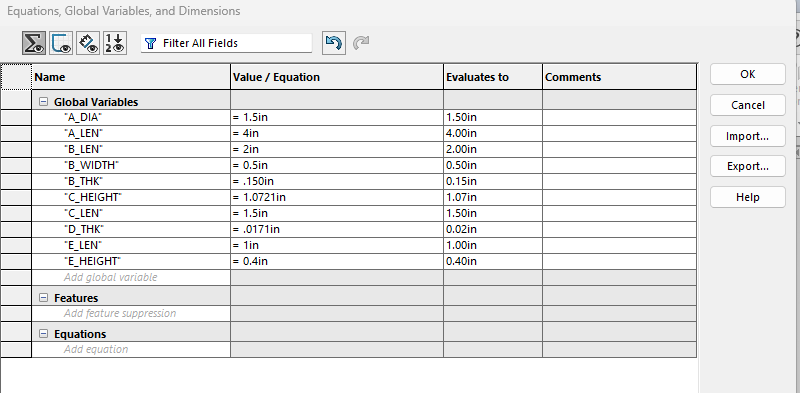
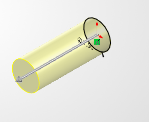
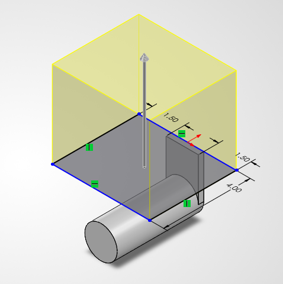
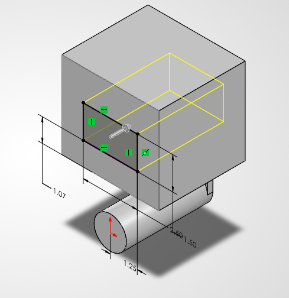
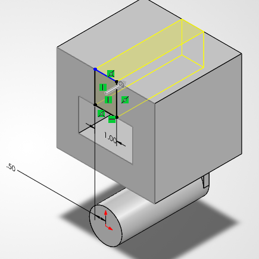
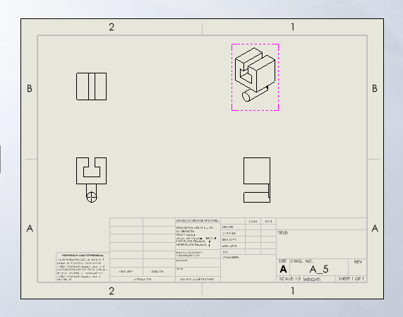
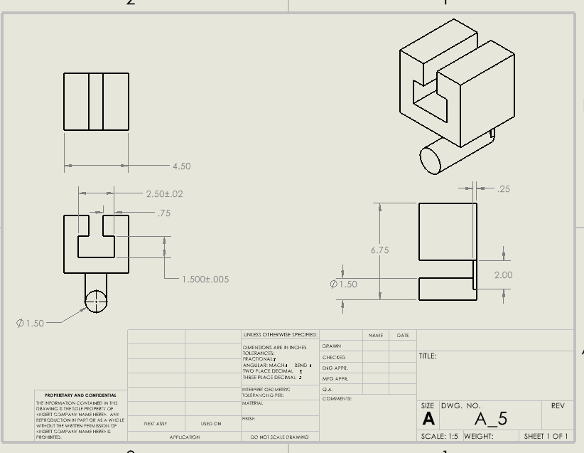
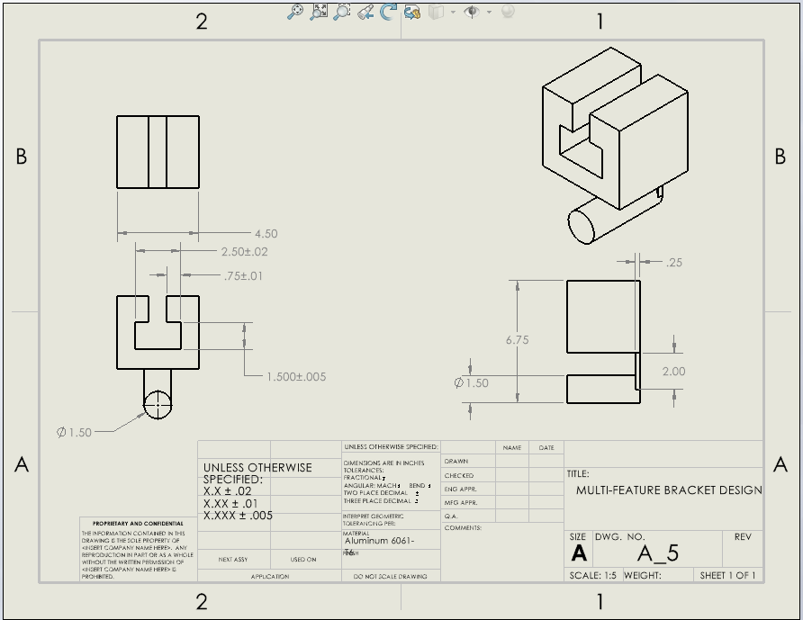

# A6 – [Topic]

## Objective
### Parametric design

Global Variables and Equations Created
The first step was creating global variables in SolidWorks to use in defining the dimensions of the bracket. The global variables were responsible for controlling dimensions like the cylinder diameter, height of the bracket, wall thickness, among others. Creating global variables made the model parametric.

## Analyze
### SOLIDWORKS STEPS 

The lower cylindrical part of the bracket was created first. Dimensions were set for the cylinder according to the design requirements. This part served as the lower support portion of the bracket.
A main rectangular body was created above the cylinder. Dimensions for this body were specified according to the values obtained during engineering analysis and global variables.

Proper constraints were specified to ensure that the body was correctly oriented with respect to the cylindrical base. Some relations and dimensions were applied to ensure that the geometry was correctly oriented.

I sketched the opening necessary for the bracket to be slid over the rigid T-beam. The dimensions of the opening were found based on the sliding fit dimensions. The dimensions for the opening were linked to the relevant global variables instead of being set directly. This way, the size of the opening will automatically change if the design dimensions change.
I sketched the upper sections of the bracket around the opening. The wall thicknesses, heights, and distances between them were defined using the dimensions obtained during the analysis. The relations and dimensions of the sketch were used to completely describe the geometry, so that if a global variable was changed, all features would stay properly aligned. I reviewed the important dimensions, including cylinder dimensions, wall thicknesses, opening dimensions, and the overall bracket dimensions, to make sure they match the design values.

## Engineering drawing

A new drawing sheet of SolidWorks was created from the existing bracket model and the right size of the sheet was chosen. The drawings of the front, top and side views were included along with the isometric view of the bracket in order to ease the understanding of its geometry. I increased the scale of the drawing views in order to ensure effective usage of the sheet space while still providing enough space for the dimensions. I used the feature of Smart Dimension in order to provide attention to the most important manufacturing dimensions, which include overall dimensions, wall thickness, dimensions of openings and the diameter of the cylinder. I included engineering tolerances to those dimensions which affect the functionality of the bracket. For example, the dimension of 1.500 in was provided with a tolerance of: 1.500 ± 0.005 in
I added the required general tolerance information to the title block. Center marks have been added to the circular part and center lines have been added wherever necessary for proper depiction of the cylindrical part. “Multi-Feature Bracket Design,” the title of the drawing, has been added and all other relevant information about the drawing has been added to the title block. An inspection of the drawing has been done to make sure that the dimensions are readable, tolerances are depicted correctly, views are arranged properly, and enough information is present to make the bracket. After verifying dimensions, tolerances, and title block information, the multiview engineering drawing has been finalized.
## Reflections 
### Analytical equation used in the parametric model
 
One engineering lesson I learned was how to connect an analytical design equation directly to a CAD dimension instead of treating the calculation and the model as separate steps. I used a bending-stress relationship to size one of the bracket features, and for a rectangular section, which can be rearranged to solve for the required height. 
σ=M/Z, Z=bh^2/6, h=√(6M/bσ)
The reason why these equation worked is because of the fact that it was the factor that kept that particular bracket at the appropriate height level. In SolidWorks, I defined the global variables for the various design values and then tied the height generated from them to the sketch dimension through the menu of Equations, Global Variables, and Dimensions. This allows me to drive the dimension in CAD through the mathematical formula rather than specifying a specific value.

### Tight and loose tolerances

I maintained a tighter tolerance on the 1.500 in mating dimension: 1.500 ± 0.005 in
This component is one of those that constitute the sliding fit with the rigid T-beam, thus the need to maintain a tighter tolerance in this dimension. An opening that is too small would not allow the bracket to be slid onto the beam while excessive clearance would result into excessive motion.

For an important dimension such as the overall size of 2.5 in, a looser tolerance would be appropriate. The above mentioned dimension does not control the fit with any of the other mating surfaces and therefore it does not affect the functioning of the bracket. Thus maintaining a tighter tolerance on this dimension would result into increased cost of manufacture and assembly.

## PART AND DARWING FILE 

[Download A5 SolidWorks Files](A5_SolidWorks_Files.zip)
